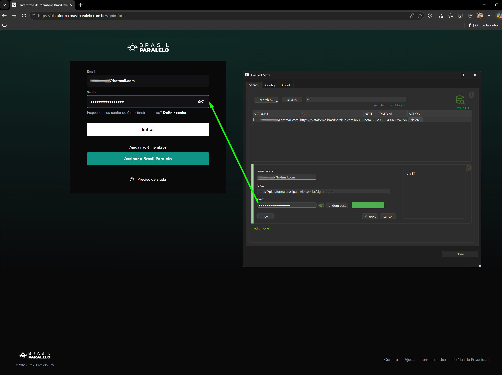
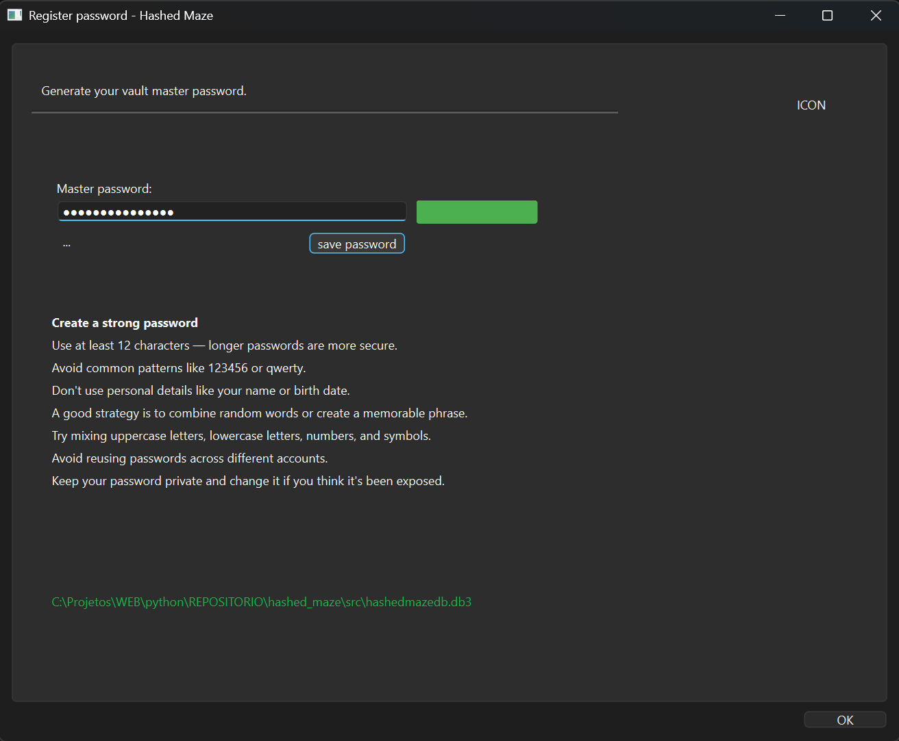
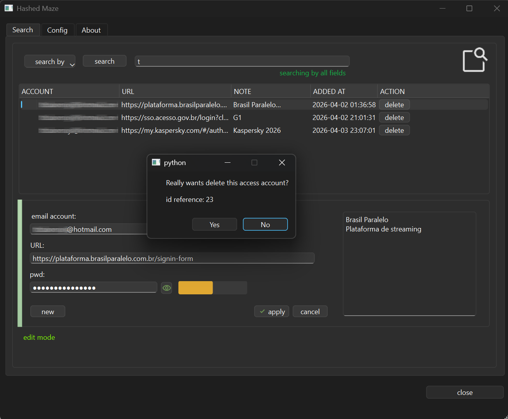
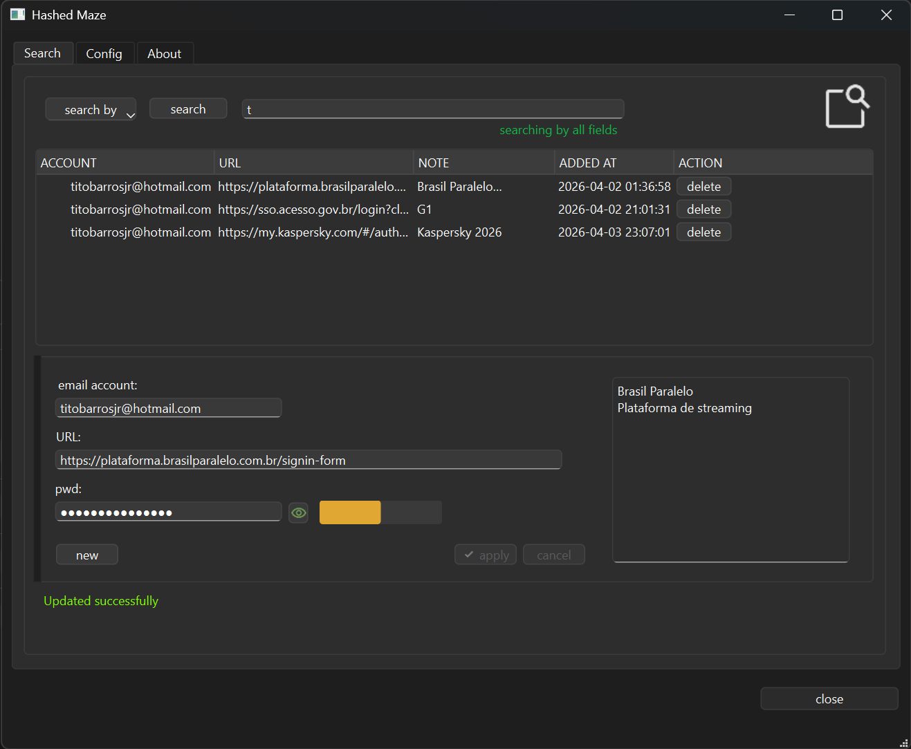
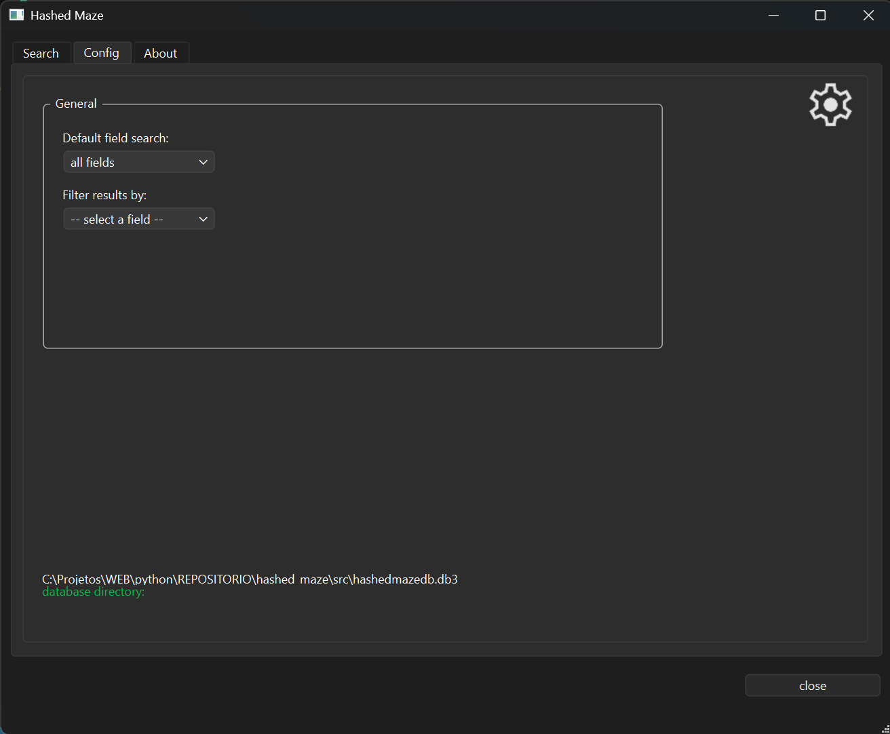
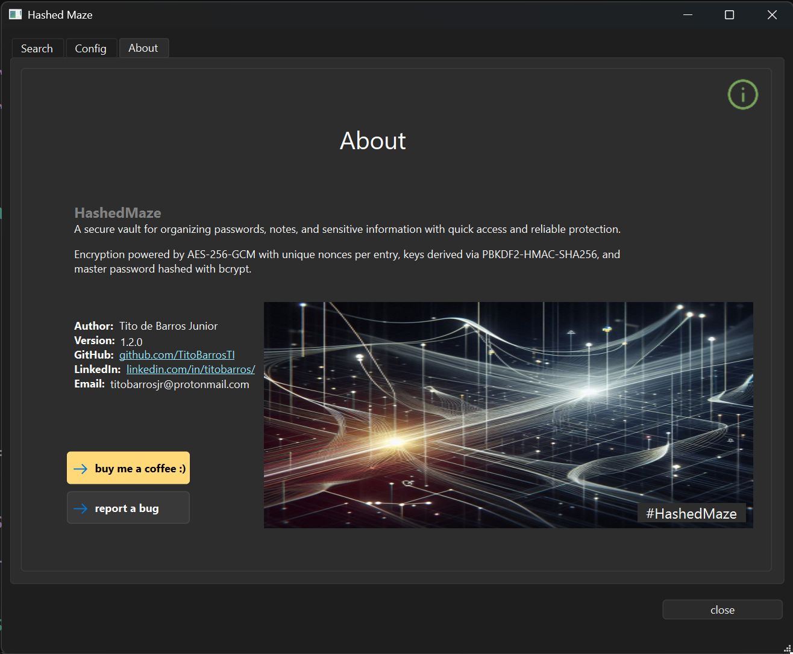

# 🔐 Hashed Maze
### A local password manager built with Python and PySide6


---

## 📖 About

**Hashed Maze** is a local-first password manager that stores all credentials encrypted on your own machine — no cloud, no third-party servers, no data leaving your device.

Built with Python and PySide6, it features a clean desktop interface, AES-256-GCM encryption, master password protection, and a browser extension integration for Chrome and Edge via Native Messaging.

---

## ✨ Features

- 🔒 **AES-256-GCM encryption** — industry-standard symmetric encryption for all stored credentials
- 🧠 **Master password protection** — single access point with bcrypt-based key derivation
- 🔍 **Search & manage** — find, add, edit, and delete credentials with ease
- 💡 **Password strength indicator** — real-time feedback powered by `zxcvbn`
- 🧩 **Browser extension** — Native Messaging integration for Chrome and Edge
- 🖥️ **100% local** — your data never leaves your machine
- 🪟 **Windows desktop app** — native look and feel via PySide6/Qt

---

## 🚧 Roadmap

- [ ] Settings tab — application preferences and configuration
- [ ] Auto-lock after inactivity
- [ ] Password generator

---

## 📸 Screenshots

| Autofill in action — Brasil Paralelo streaming site |
|---|
|  |

| Master Password | Search & Delete |
|---|---|
|  |  |

| Search Tab | Config Tab | About Tab |
|---|---|---|
|  |  |  |

---

## 🗂️ Project Structure

```
hashed_maze/
├── docs/
│   └── screenshots/
│       ├── hashed_maze_about_tab.png
│       ├── hashed_maze_config_tab.png
│       ├── hashed_maze_master_password_register.png
│       ├── hashed_maze_obtaining_password.png
│       ├── hashed_maze_search_delete_item.png
│       └── hashed_maze_search_tab.png
├── extension/
│   ├── background.js  # Service worker (Chrome/Edge)
│   ├── content.js  # Content script for autofill
│   └── manifest.json  # Extension manifest (MV3)
├── src/
│   ├── core/
│   │   └── state.py  # Centralized app state
│   ├── native_messaging/
│   │   └── registry.py  # Windows registry setup for Native Messaging
│   ├── utils/
│   │   ├── dialogs.py  # Reusable dialog helpers
│   │   ├── password_strength.py  # zxcvbn wrapper
│   │   └── resource_path.py  # Path resolution for bundled assets
│   ├── bridge.py  # Native Messaging host (Python ↔ Browser)
│   ├── config.py  # App configuration constants
│   ├── crypt.py  # AES-256-GCM encryption (CryptoVault)
│   ├── database.py  # SQLite layer (SQLiteDB)
│   ├── login_window_hashed_maze.py
│   ├── main_window_hashed_maze.py
│   ├── master_pass_hashed_maze.py
│   ├── models.py  # Data models
│   ├── password_server.py  # Local password server for extension
│   ├── popup_hint.py  # Hover hint popup widget
│   └── setup.py  # Native Messaging host registration
├── static/
│   └── icons/
│       ├── about_50.png
│       ├── apply_20.png
│       ├── search_50.png
│       ├── settings_50.png
│       ├── visibility_20.png
│       └── visibility_off_20.png
├── ui/
│   ├── login_window_hashed_maze.ui
│   ├── main_window_hashed_maze.ui
│   └── master_pass_hashed_maze.ui
├── host_manifest.json  # Native Messaging host manifest
├── main.py  # Application entry point
├── roundedframe.py  # Custom QFrame with rounded corners
├── run_bridge_python_host.bat  # Launches Native Messaging bridge
├── requirements.txt
├── LICENCE
└── README.md
```

---

## ⚙️ Installation

### Prerequisites

- Python 3.12+
- Windows 10 or later
- Google Chrome or Microsoft Edge (for browser extension)

### Setup

**1. Clone the repository**
```bash
git clone https://github.com/TitoBarrosTI/hashed_maze.git C:\hashed_maze
cd hashed_maze
```

**2. Create and activate a virtual environment**
```bash
python -m venv .venv
.venv\Scripts\activate
```

**3. Install dependencies**
```bash
pip install -r requirements.txt
```

### Browser Extension

**4. Load the extension in Chrome/Edge**
- Open `chrome://extensions` or `edge://extensions`
- Enable **Developer mode**
- Click **Load unpacked** and select the `extension/` folder

**5. Run the application**
```bash
python main.py
```
---
## ⚠️ Troubleshooting

### Error: Specified native messaging host not found

The extension relies on its Chrome-generated ID to communicate with the native host.

This ID is derived from the extension's directory when loaded unpacked.
If the directory is moved or differs from the one used during installation (e.g. `C:\hashed_maze`), the ID will change and communication will fail.

**Solution:**
- Keep the extension in the same directory defined during installation
OR
- Update the "allowed_origins" field in the native host manifest with the current extension ID (chrome://extensions)

---

## 🔐 Security Notes

- All credentials are encrypted with **AES-256-GCM** before being stored in SQLite
- The master password is never stored — only its derived key is used at runtime
- The database file (`.db3`) is stored locally and is not tracked by version control
- No telemetry, no network calls, no external dependencies beyond the listed packages

---

## 🧰 Tech Stack

| Layer | Technology |
|---|---|
| Language | Python 3.12+ |
| GUI Framework | PySide6 / Qt 6.10 |
| Database | SQLite via `sqlite3` |
| Encryption | AES-256-GCM (`cryptography`) |
| Password Analysis | `zxcvbn` |
| Browser Integration | Native Messaging (Chrome/Edge) |

---

## 📄 License

This project is licensed under the MIT License — see the [LICENCE](LICENCE) file for details.